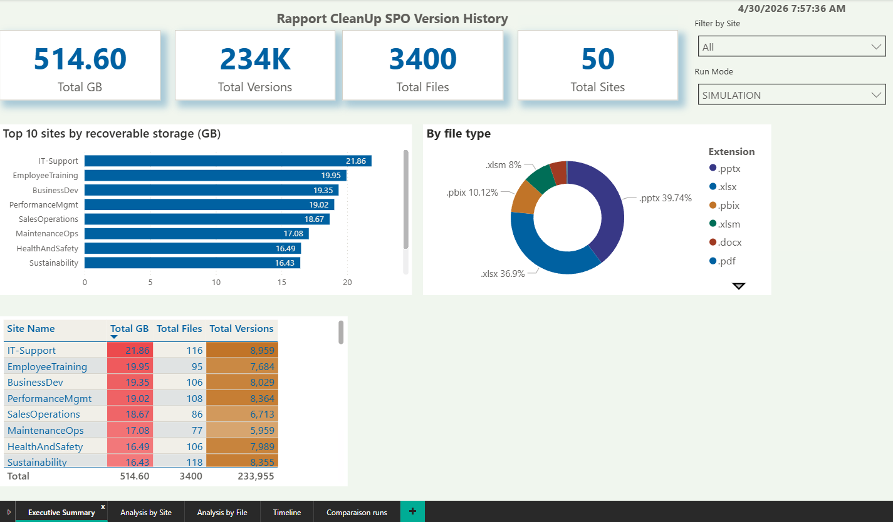
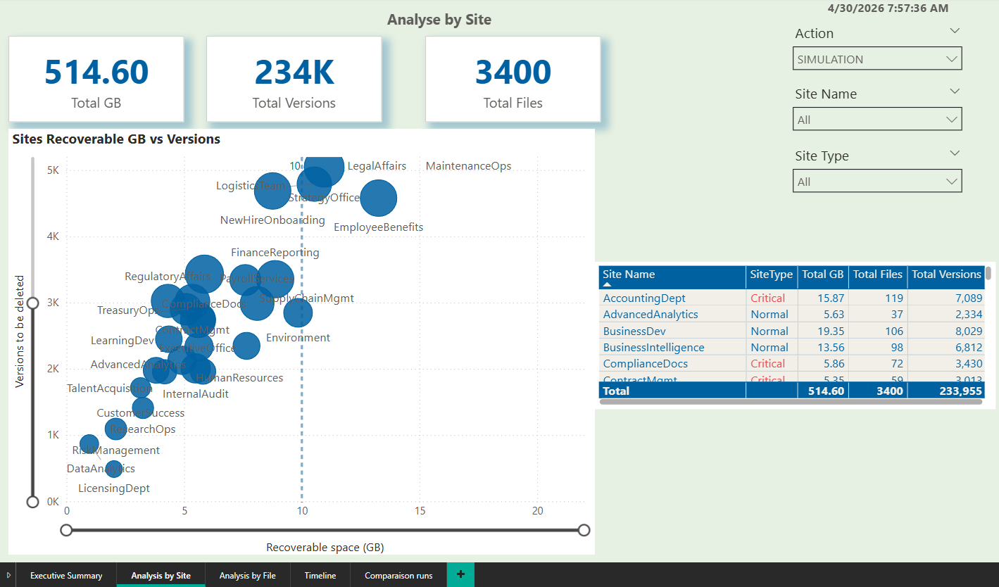

# Remove-SPOVersionHistory : SharePoint Online Version History Cleanup

> 🇫🇷 [Version française disponible ici](README.fr.md)

PowerShell script to automatically clean up file version history across all SharePoint Online sites in your tenant.

> This script is designed as a **governance tool**.
> It complements SharePoint Intelligent Versioning and Microsoft Purview, but does not replace them.

---

## Who is this script for

This script is intended for SharePoint Online administrators, Microsoft 365 and Entra ID administrators, and IT Governance and Compliance teams.

It is not intended for end users.

---

## When NOT to use this script

Do not use this script if you have not validated governance with business teams, if you have not analyzed the simulation report beforehand, or if you must comply with strict legal retention requirements without prior validation from your compliance team.

---

## The problem

SharePoint Online keeps up to **500 versions per file** by default on existing libraries.
Intelligent versioning was introduced in 2024, but it only applies to new libraries created after activation.

> **Important** : Enabling automatic mode does NOT clean up existing versions.
> It only applies to new versions created after the change.
> Older libraries continue to silently accumulate versions.

A single PowerPoint file edited regularly can consume **several hundred MB** in unused versions.
Multiply that by thousands of files across dozens of sites, and you have a storage problem.

> **Before buying additional storage, audit your version history.**

---

## What this script does NOT do

This script does not delete files, does not bypass retention labels, does not replace Microsoft Purview, does not modify SharePoint versioning settings, and does not replace a compliance or records management policy.

---

## Why not New-SPOSiteFileVersionBatchDeleteJob?

Microsoft provides a native command to clean up existing versions:

```powershell
New-SPOSiteFileVersionBatchDeleteJob -Identity $siteUrl -Automatic
```

> ⚠️ **Major issue**: Versions deleted by this command do NOT go to the recycle bin and are **not recoverable**.

This script offers simulation mode before any deletion, recycle bin mode (recoverable ~93 days), a CSV report exportable to Power BI, a JSON summary generated at each run, a differentiated Normal vs Critical policy, and complete logs for audit.

---

## Features

The script scans the entire tenant automatically in a single run (tested on 200+ sites) with two authentication modes: Interactive (laptop) or Certificate (server). It supports testing on 1 or more sites before running on the entire tenant.

The retention policy is differentiated between normal sites and critical sites. Simulation mode is enabled by default before any deletion. Recycle bin mode allows a safe first production run (recoverable ~93 days). Automatic retry handles HTTP timeouts with progressive backoff (10s, 20s, 30s) and large files are automatically skipped in interactive mode (configurable via MaxFileSizeMB).

Each run generates a CSV report exportable to Power BI and a JSON summary. The RunId, RunMode, RunDate and SiteType columns allow comparing runs against each other. System libraries and sites are automatically ignored (SharePoint EN + FR). Access denied sites are listed separately. Human confirmation is required before any production run. No secrets are stored in the script. Everything is passed via environment variables.

---

## Power BI report included

A `.pbit` template file is available in the repository to visualize results.
It contains no real data. Simply connect it to your CSV folder.

```
Available pages:
Executive Summary   : Global KPIs, top sites, breakdown by extension
Analysis by Site    : Scatter plot GB vs Versions, detailed table
Analysis by File    : Top 20 files, table with drill-down
Timeline            : Recoverable space and versions by month
Run Comparison      : Compare SIMULATION vs PRODUCTION-RECYCLE
```

To use it:
```
1. Copy your CSV files to C:\Temp\SPOVersionCleanup\
2. Open the .pbit file in Power BI Desktop
3. Update the pReportFolder parameter
4. Refresh
```
---



---

## Retention policy

| Site type | Policy | Versions kept |
|---|---|---|
| Normal | Option A: Total | 10 versions total (9 history + current) |
| Critical | Option B: History | 50 history versions + current |

> **Technical note**: `Get-PnPFileVersion` does not return the current version.
> Option A "10 total" = 9 history + current = 10 total versions kept.

---

## Relationship with native SharePoint settings

SharePoint Online has native versioning controls: age-based (versions older than X days deleted) and count-based (maximum X major versions kept).

This script adds a **third layer**: threshold-based with a Normal/Critical policy defined by your organization.

These rules are complementary, not contradictory. SharePoint protects history over time. This script protects storage with controlled and auditable limits.

---

## OneDrive

Personal OneDrive sites are **ignored by default**.

Reasons: personal data (privacy considerations), different permissions required, recommended to handle separately with HR/management approval.

To include OneDrive, comment out or remove the skip condition in the script.

---

## Requirements

- PowerShell 7.4+
- PnP.PowerShell 3.x+
- Microsoft Entra ID App Registration (see Authentication section)
- **SharePoint Administrator** or **Global Administrator** role

---

## Authentication

This script supports **two authentication modes**.
No secrets are stored in the script. All values are passed via environment variables.

---

### Mode 1: Interactive (laptop / local testing)

Best for: first test, connection validation, testing on 2-3 sites maximum.

> ⚠️ **Important limitation**: Interactive mode is designed for **validation and testing only**.
> For large files (.pbix, .pptx) or tenants with 50+ sites,
> use certificate mode even on a laptop to avoid timeouts.

#### Create the Entra ID App Registration

```
portal.azure.com
→ Microsoft Entra ID
→ App registrations
→ New registration
   Name         : SP-Version-Cleanup
   Redirect URI : https://login.microsoftonline.com/common/oauth2/nativeclient
→ Register
→ Copy the Application (client) ID
```

#### Add permissions

```
→ API permissions → Add a permission

Permission 1: required for interactive mode
   SharePoint → Delegated → AllSites.FullControl

Permission 2: for certificate mode
   SharePoint → Application → Sites.FullControl.All

→ Grant admin consent for [your organization]
→ Verify both permissions show: Granted ✅
```

> ⚠️ **Important**: The delegated permission `AllSites.FullControl` is **required** for interactive mode.
> Without it, you will get a 403 error on `Get-PnPTenantSite`,
> even if you have the SharePoint Administrator or Global Administrator role.

#### Configuration and launch

```powershell
$env:SP_TENANT    = "your-tenant.onmicrosoft.com"
$env:SP_CLIENT_ID = "your-entra-client-id"

.\Remove-SPOVersionHistory.ps1 -UseInteractive
```

---

### Mode 2: Certificate (server / unattended / production)

Best for: servers, scheduled tasks, full tenant scan. Runs fully unattended, no popup.

#### Step 1: Create the certificate and App Registration

```powershell
# On your server, PowerShell 7 as administrator
Register-PnPEntraIDApp `
    -ApplicationName "SP-Version-Cleanup" `
    -Tenant "your-tenant.onmicrosoft.com" `
    -OutPath "C:\Certs" `
    -CertificatePassword (ConvertTo-SecureString "YourPassword" -Force -AsPlainText) `
    -SharePointApplicationPermissions "Sites.FullControl.All" `
    -DeviceLogin
```

This command generates:
```
C:\Certs\SP-Version-Cleanup.pfx  (private key, keep secret)
C:\Certs\SP-Version-Cleanup.cer  (public key, for Entra ID)
App Registration created in Entra ID
Sites.FullControl.All permission assigned
ClientId displayed in console, note it down
```

#### Step 2: Upload the certificate to Entra ID

```
portal.azure.com
→ Microsoft Entra ID → App registrations
→ SP-Version-Cleanup
→ Certificates & secrets → Certificates
→ Upload certificate → Select SP-Version-Cleanup.cer
→ Add
```

#### Step 3: Grant admin consent

```
→ API permissions
→ Grant admin consent for [your organization] → Yes
→ Verify: Sites.FullControl.All → Granted ✅
```

#### Step 4: Configuration and launch

```powershell
$env:SP_TENANT        = "your-tenant.onmicrosoft.com"
$env:SP_CLIENT_ID     = "your-entra-client-id"
$env:SP_CERT_PATH     = "C:\Certs\SP-Version-Cleanup.pfx"
$env:SP_CERT_PASSWORD = "YourPassword"

.\Remove-SPOVersionHistory.ps1
```

---

### Optional: Override URLs

By default, URLs are automatically derived from SP_TENANT.
If your SharePoint URL differs from your tenant name:

```powershell
$env:SP_TENANT_URL = "https://your-tenant.sharepoint.com"
$env:SP_ADMIN_URL  = "https://your-tenant-admin.sharepoint.com"
```

---

## Quick start

### Step 1: Define your critical sites

Open the script and customize `$CriticalSites`:

```powershell
$CriticalSites = @(
    "Accounting",     # /sites/Accounting
    "LegalAffairs",   # /sites/LegalAffairs
    "PeopleOps",      # /sites/PeopleOps
    "RegulatoryDocs", # /sites/RegulatoryDocs
    "AuditReports"    # /sites/AuditReports
)
```

> **Important**: `$CriticalSites` uses simple keyword matching by design.
> Validate the list with your compliance team before production.

#### How to identify your critical site keywords

```
Site URL:
https://tenant.sharepoint.com/sites/AuditReports2024
                                      ↑
                          Use this part: "AuditReports"
```

Three ways to find your site names: from the browser URL (copy the part after /sites/), from the SharePoint Admin Center (Active sites → URL column → part after /sites/), or via PowerShell (`Get-PnPTenantSite | Select-Object Url`).

**Best practices**: use stable and descriptive keywords, avoid short values (risk of false positives), and validate with your compliance team.

---

### Step 2: Test on 1 or 2 sites first (strongly recommended)

```powershell
$env:SP_TENANT    = "your-tenant.onmicrosoft.com"
$env:SP_CLIENT_ID = "your-client-id"

# Test on a single site
.\Remove-SPOVersionHistory.ps1 -UseInteractive -TestSite "AuditReports"

# Test on multiple sites
.\Remove-SPOVersionHistory.ps1 -UseInteractive -TestSites @("Accounting","LegalAffairs")
```

> **Note**: With `-TestSite`, the script connects **directly** to the site
> without calling `Get-PnPTenantSite`. This avoids 403 errors related to admin center permissions.

---

### Step 3: Simulation on the entire tenant

```powershell
# ModeTest = $true by default, no deletions performed
.\Remove-SPOVersionHistory.ps1
```

Review the CSV report in `C:\Temp\SPOVersionCleanup\`

---

### Step 4: Production run, recycle bin mode

Edit the script:
```powershell
$ModeTest    = $false
$ModeRecycle = $true
```

Run:
```powershell
.\Remove-SPOVersionHistory.ps1
```

Wait **2-3 weeks**. Verify no incidents are reported.

---

### Step 5: Permanent deletion (optional)

```powershell
$ModeTest    = $false
$ModeRecycle = $false
```

---

## Recommended execution order

```
Step 1: ModeTest=$true  + ModeRecycle=$true  : Simulation  (review CSV)
Step 2: ModeTest=$false + ModeRecycle=$true  : Production  (recycle bin ~93 days)
Step 3: ModeTest=$false + ModeRecycle=$false : Permanent   (optional)
```

> `$ModeTest` and `$ModeRecycle` are intentionally hardcoded as a safety mechanism.
> You must explicitly change them before running in production.

---

## Large files and timeouts

The `MaxFileSizeMB` parameter is automatically configured based on the authentication mode:

```
Interactive mode : MaxFileSizeMB = 800  (avoids PnP 100s timeouts on large files)
Certificate mode : MaxFileSizeMB = 0    (no limit, stable connection)
```

Skipped files appear in the logs:
```
[WARN] SKIP_LARGE : 1208 MB > limit 800 MB
[WARN] TIP : Set MaxFileSizeMB=0 with certificate mode to process this file
```

---

## Verifying freed space after recycle bin

> ⚠️ **Important**: Recycle bin mode does NOT free space immediately.
> Versions in the recycle bin still count against the SharePoint quota.

Space is actually freed when the recycle bin is emptied manually, after ~93 days automatically, or by running `ModeRecycle=$false`.

> After emptying the recycle bin, space may take **24-48 hours** to update in the SharePoint Admin Center.

Three ways to verify freed space:

```powershell
# 1. Via PowerShell (precise and immediate)
Get-PnPTenantSite `
    -Url "https://your-tenant.sharepoint.com/sites/YourSite" |
    Select-Object Url, StorageUsageCurrent

# 2. SharePoint Admin Center
#    Active sites → Storage used column

# 3. Site recycle bin
#    /sites/YourSite → Site contents → Recycle bin
```

---

## Comparing runs in Power BI

Each run generates a CSV report with the following columns:

| Column | Description |
|---|---|
| RunId | Unique run identifier (e.g., 20260427_121235) |
| RunMode | SIMULATION / PRODUCTION-RECYCLE / PRODUCTION-DELETE |
| RunDate | Run date |
| SiteType | Normal / Critical |
| Action | SIMULATION / RECYCLED / DELETED |

To compare simulation vs production: copy all CSV files to `C:\Temp\SPOVersionCleanup\`, Power BI automatically reads the entire folder, filter by RunMode to compare, and use the File column as the join key between runs.

---

## CSV report columns

| Column | Description |
|---|---|
| Site | SharePoint site URL |
| Library | Library name |
| File | Full file path |
| SiteType | Normal / Critical |
| HistoryVersions | History versions found |
| ThresholdKept | History versions kept |
| Removed | Versions removed |
| SpaceMB | Recovered space in MB |
| LastModified | Last modification date |
| Action | SIMULATION / RECYCLED / DELETED |
| RunId | Run identifier |
| RunMode | Run mode |
| RunDate | Run date |

---

## Important note

This script reduces storage consumption by removing old file versions.
It does **not** replace Microsoft Purview retention labels or records management for regulatory compliance.

---

## Changelog

### v1.0.3
- NEW : Mutual exclusion validation for `-TestSite` vs `-TestSites`
- NEW : `MaxFileSizeMB` automatic based on auth mode (800 interactive / 0 certificate)
- NEW : `-TestSite` and `-TestSites` connect directly to the site without `Get-PnPTenantSite`
- NEW : More explicit "PnP 100s timeout" log message
- FIX : Internal version number removed from header

### v1.0.2
- NEW : RunId, RunMode, RunDate in each CSV row
- NEW : SiteType (Normal/Critical) in each CSV row
- NEW : JSON summary generated at each run
- NEW : Progressive retry on timeout (10s, 20s, 30s)
- NEW : Automatic large file skip in interactive mode
- FIX : Continue after timeout instead of hanging indefinitely

### v1.0.1
- NEW : `-TestSite` to test on a specific site
- NEW : `-TestSites` to test on multiple sites

### v1.0.0
- NEW : `-UseInteractive` to test on laptop without certificate
- Single script for both laptop (interactive) and server (certificate)

---

## License

MIT License, free to use, modify, and distribute.

## Author

Abdoulaye Ndao
[LinkedIn](https://www.linkedin.com/in/abdoulaye-ndao-m-sc-055241126/) | [GitHub](https://github.com/abdoulayendao007/Remove-SPOVersionHistory)
